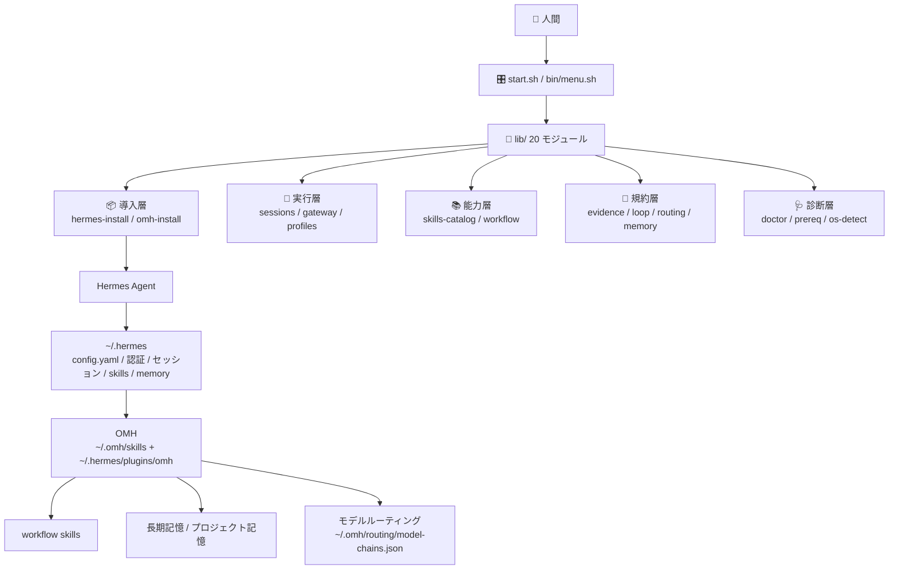

# ⚚ HermesAgentOS-StartUpTools-Linux

Linux ローカルで **HermesAgentCLI**（Hermes Agent）と **Oh My Hermes（OMH）** を
導入・検証・起動し、OMH の運用レイヤ（ワークフロー、スキルカタログ、プロジェクト記憶、
モデルルーティング、evidence boundaries、Loop Engineering）を扱うスタートアップツールです。

SSH 接続や Windows/PowerShell 経路は持たず、`tmux` を使った Linux native 構成です。

| 項目 | 値 |
|---|---|
| バージョン | **1.0.0-linux** |
| 対象 | HermesAgentCLI + Oh My Hermes (OMH) |
| 検証済み環境 | Ubuntu 24.04.4 LTS / x86_64 / apt |
| 導入済み Hermes | **v0.21.2** (2026.9.11 · upstream b7b35a84) |
| 導入済み OMH | **2.0.3** (source ref v2.0.3) |
| 上流診断 | `omh doctor` **48/48 passing, 0 blocking** |
| テスト | **65 pass / 0 fail** (bats) |
| Lint | shellcheck `-S warning` clean |

> **このツールの立ち位置**
> `oh-my-hermes` は Hermes の上に載る運用レイヤであり、Hermes 本体を置き換えません。
> 本ツールはそのさらに上に載る **導入・運用の入口** です。上流のコマンドを
> 置き換えず、安全に呼び出し、状態を実測して表示します。

---

## ⚡ クイックスタート

```bash
cp config/config.json.template config/config.json
./start.sh
```

メニューが開きます。初回は上から順に実行してください。

| 手順 | メニュー | コマンド |
|---|---|---|
| 1. 前提確認 | `19` | `./start.sh prereq` |
| 2. Hermes 導入 | `1` | `./start.sh install hermes` |
| 3. OMH 導入 | `2` | `./start.sh install omh` |
| 4. OMH setup | `3` | `./start.sh setup omh` |
| 5. 診断 | `4` | `./start.sh doctor` |
| 6. 起動 | `6` | `./start.sh start` |

> **重要**: 導入と更新は必ず確認を挟みます。`install` は上流 installer の内容を
> 表示してから承認を求めます。`installer` を無確認で流すことはしません。

---

## 🗺️ 全体アーキテクチャ



### データ領域（upstream で確認済みの配置）

| 種別 | パス |
|---|---|
| Hermes コード | `~/.hermes/hermes-agent/` |
| Hermes コマンド | `~/.local/bin/hermes` |
| Hermes データ | `~/.hermes/`（`HERMES_HOME` で上書き可） |
| Hermes 設定 | `~/.hermes/config.yaml` |
| OMH スキル | `~/.omh/skills` |
| OMH プラグイン | `~/.hermes/plugins/omh` |
| OMH ルーティング | `~/.omh/routing/model-chains.json` |
| プロファイル | `~/.hermes/profiles/<name>/` |

---

## ✨ 実装している6つの機能

依頼時に掲げられた6機能を、すべて実行可能な形で実装しています。

### 1. ワークフロー集 — `./start.sh workflows`

標準工程（計画 → 調査 → 作成 → 実装引き継ぎ → 運用 → 記憶）と、
6つの能力ファミリー／9つの役割を対応付けて表示します。
「依頼を受けていきなり実装しない」ための入口です。

```bash
./start.sh workflows
```

### 2. スキルカタログ — `./start.sh skills ...`

123 スキルを実測またはスナップショットから列挙します。

```bash
./start.sh skills summary        # 件数とデータ源
./start.sh skills list           # 全スキル
./start.sh skills search memory  # 絞り込み
./start.sh skills family plan_and_decide
./start.sh skills show           # 全ファミリー詳細
```

> **実測と掲載値の差**
> OMH の公開ページは 116 skills / 9 workflows / 7 families / 8 languages を掲げていますが、
> 実インストール後の実測は **123 skills / 9 役割ディレクトリ / 6 capability families** です。
> 本ツールは実測を優先し、差がある場合は両方を併記します。
> 実レイアウトは `<役割>/<スキル名>/SKILL.md` の3段です。
> 詳細は `docs/SOURCE_OF_TRUTH.md`。

実インストール後の役割別内訳（実測）:

| 役割 | スキル数 | | 役割 | スキル数 |
|---|---:|---|---|---:|
| operator | 37 | | researcher | 9 |
| guide | 18 | | ultrawork | 9 |
| tracker | 18 | | memory-keeper | 5 |
| planner | 12 | | handoff-guide | 3 |
| reviewer | 12 | | **合計** | **123** |

> **コンテキスト費用の注意**
> `omh doctor` によると 123 スキルは **約 43,050 トークン**の常時コンテキストを消費します。
> `tools.tool_search.enabled` は既定で `auto`（threshold 10%）なので、無効化せず維持してください。
> 常時ロードされるスキルを絞るには `hermes skills config` / `hermes skills opt-out` を使います。

### 数字の内訳（混同しやすい点）

TUI の起動バナーは `177 skills in 20 categories` と表示します。本ツールが `123` と
表示するのは **OMH が配置した分だけ** だからです。`hermes skills list` の実測は:

```text
0 hub-installed, 53 builtin, 123 local — 176 enabled, 0 disabled
```

| 数 | 意味 |
|---|---|
| 58 | `~/.hermes/skills` に展開された同梱 skills（ディスク上） |
| 123 | OMH が `~/.omh/skills` に配置した skills |
| **176** | Hermes が見ている **enabled 総数**。`58 + 123 = 181` から重複5件（`planner` `researcher` `reviewer` `operator` `memory-keeper`）を除いた数 |

**役割と category は別の軸です。**

| 軸 | 内容 |
|---|---|
| 役割（=ディレクトリ） | OMH が skills を置く場所。**9 種** |
| category | Hermes 自身の分類。TUI の category 列に出る。**20 種** |

同じ 1 スキルが両方の属性を持ちます。混同しないでください。
`./start.sh skills summary` は両方を併記します。

### 3. Agentic Memory — `./start.sh memory ...`

`~/.hermes` 配下の記憶領域を可視化し、バックアップと復元を提供します。
**本ツールは記憶の内容を解釈・改変しません**（Hermes の領分です）。

```bash
./start.sh memory status     # 所在の可視化
./start.sh memory backup     # 記憶 + 設定を tar.gz に退避 (権限 600)
./start.sh memory list       # バックアップ一覧
./start.sh memory guidance   # 何を記憶として残すべきか
```

### 4. モデルルーティング — `./start.sh routing ...`

高コストモデルを常用しないための割り当てを扱います。

```bash
./start.sh routing readiness # 上流の準備度を要約 (推奨)
./start.sh routing status    # 上書き状況
./start.sh routing seed      # 空の上書き文書を作成
./start.sh routing set research cheap-a fast-b   # チェーン設定 (自動バックアップ)
./start.sh routing validate  # schema 検証
./start.sh routing guidance  # 仕事別の設計指針
```

`routing readiness` は上流の `omh coding model-routing status --json` を呼び、
**判断に必要な要点だけ**を表示します（生出力は 100KB 超になり得るため）。

実測値（2026-09-12 時点）:

| 項目 | 値 | 意味 |
|---|---:|---|
| `confirmed` | **0** | 実行に使えると確認できたモデルは **無い** |
| `discovered_only` | 668 | 設定や履歴から見つかっただけ。**実行証明ではない** |
| `discovered` ユニーク名 | 4 | 668 件は同じ名前の重複を多数含む |
| Hermes aliases | `aliases_unset` | 未設定 |
| Maestro 欠落 head | 9 件 | `kimi-k3` ほか |
| owner learning | `missing` | 学習履歴なし |

> **重要**: `confirmed` が 0 の間、**委譲先は未証明**です。確定するには:
> ```bash
> omh model-chains interview
> ```
> 上流の主張境界もそのまま表示します:
> 「discovered は実行証明ではない。confirmed は権限・資格情報・実行・レビュー・CI・
> マージの証拠ではない。ネットワーク要求は行っていない。」

`./start.sh doctor` はこの準備度を **[6]** として自動検査し、`confirmed 0` のとき
`recommended_next_action` に出します。

対話設定は Hermes 内の `/omh-model-setup` を使います（本ツールは上流を置き換えません）。

### 5. Evidence boundaries — `./start.sh evidence ...`

「実際に確認したこと」と「未確認の前提・提案」を区別させます。
4区分は **OBSERVED / PREPARED / PROPOSED / NOT_OBSERVED** です。

```bash
./start.sh evidence rules    # 規約本文
./start.sh evidence write    # HERMES_HOME/EVIDENCE_RULES.md に書き出す
./start.sh evidence check    # 本ツール自身の主張を検証 (自己適用)
```

`evidence check` は本ツール自身に規約を適用します。
観測が 0 件のときに「実測に基づいています」とは言いません。

### 6. Loop Engineering — `./start.sh loop ...`

不確実性の高い目標を、仮説 → 実行 → 検証 → 判断で反復します。

```bash
./start.sh loop new "PoC" "既存システムを調査して改善案を作りPoCまで進める"
./start.sh loop iterate poc "仮説" "実行内容" "検証手段と結果" "判断"
./start.sh loop show poc
./start.sh loop close poc completed "まとめ"
./start.sh loop guidance
```

> **ガードレール**
> `verification` が空のイテレーションは記録できません。
> 「たぶん直った」は反復として数えません。bats で回帰テストしています。

---

## 🚀 実行セッション

```bash
./start.sh start              # フォアグラウンド起動
./start.sh bg myproject       # tmux でバックグラウンド起動
./start.sh sessions status    # 経過 / 上限 / 残り時間
./start.sh attach hermesos-myproject
```

`tmux attach` 中の `Ctrl-b d` でデタッチ = バックグラウンド継続です。
上限は `config.json` の `runtime.foregroundMinutes`（0 = 無制限）で設定します。

---

## 🩺 診断

```bash
./start.sh doctor            # 統合診断 (PASS/WARN/FAIL/SKIP + 次の一手)
./start.sh doctor --quick    # 上流 omh doctor を呼ばず高速化
```

doctor は各項目を `PASS` / `WARN` / `FAIL` / `SKIP` で明示し、
最後に `recommended_next_action` を必ず出します。
**判定できないものを PASS と偽りません**（`SKIP` と表示します）。

---

## 📂 ディレクトリ構成

```text
HermesAgentOS-StartUpTools-Linux/
├── start.sh                    起動エントリ
├── bin/menu.sh                 対話メニュー + CLI ディスパッチ
├── lib/                        20 モジュール
│   ├── bootstrap.sh            読込順序の唯一の定義
│   ├── common.sh               ログ / 確認 / カウンタ
│   ├── paths.sh                Hermes / OMH 実パス
│   ├── os-detect.sh            Linux / WSL / distro 判定
│   ├── config-loader.sh        設定の優先順位と ~ 展開
│   ├── json.sh / yaml.sh       JSON / YAML 読み出し
│   ├── prereq.sh               前提コマンド検査
│   ├── hermes-install.sh       Hermes 導入 / 更新
│   ├── omh-install.sh          OMH 導入 / setup / 更新
│   ├── skills-catalog.sh       カタログ (実測 > snapshot)
│   ├── workflow.sh             ワークフロー集 / 役割
│   ├── evidence.sh             Evidence boundaries
│   ├── loop.sh                 Loop Engineering (台帳つき)
│   ├── routing.sh              モデルルーティング
│   ├── memory.sh               記憶の可視化 / 退避
│   ├── profiles.sh             profile / bot ホーム
│   ├── gateway.sh              Gateway 常駐
│   ├── sessions.sh             tmux セッション
│   └── doctor.sh               統合診断
├── config/                     設定 + 検証済みカタログ
├── docs/                       運用文書
├── tests/bats/unit/            65 テスト
└── state.json                  検証済み事実の記録
```

---

## 🔐 安全設計

| 原則 | 実装 |
|---|---|
| 破壊的操作は確認必須 | 導入・更新・復元・セッション終了はすべて `confirm` を通す |
| dry-run | `HERMESOS_DRY_RUN=1`。**未実行なのに「完了」と言わない** |
| 設定は壊さない | `routing set` は編集前に自動バックアップ |
| 記憶を触らない | 記憶の解釈・改変はしない。可視化と退避のみ |
| 上流を置き換えない | Hermes の updater は `hermes update` に委ねる |
| 未確認を偽らない | doctor は `SKIP` を使い、evidence check で自己検証 |

### 環境変数

| 変数 | 既定 | 意味 |
|---|---|---|
| `HERMES_HOME` | `~/.hermes` | Hermes データ領域 |
| `OMH_HOME` | `~/.omh` | OMH データ領域 |
| `HERMESOS_DRY_RUN` | `0` | 実行せずコマンド表示 |
| `HERMESOS_ASSUME_YES` | `0` | 確認を自動承認（危険） |
| `HERMESOS_FOREGROUND_MINUTES` | `0` | 実行上限（0 = 無制限） |
| `NO_COLOR` | — | 色を無効化 |

---

## 🧪 開発

```bash
npm test          # bats 65 件
npm run lint      # shellcheck
./start.sh help   # 全コマンド
```

テストは必ず一時 `HOME` に隔離して実行するため、実環境の `~/.hermes` を汚しません。

---

## ⚠️ 既知の制約（未確認事項）

`state.json` の `open_items` に記録しています。正直に列挙します。

- **OMH プラグインの Hermes 実行時ロードは未観測です。**
  `omh doctor` は「import/register smoke は通過、実ローダー登録は観測、
  ただしランタイム利用は未観測」と明示しています。
  **チャット上の可視性を主張する前に Hermes を再起動してください。**
  再起動後にプラグインイベント（`plugin_load` / `tool_call` / `hook_call` /
  `status_query`）を1件記録するまでは「ネイティブ実行時に使える」とは言えません。
- **モデルルーティングは未確定です。**
  `confirmed=0 / discovered_only=668 / hermes=aliases_unset / missing_heads=9`。
  `omh model-chains interview` または `omh coding model-routing status` で確定してください。
- Skills Hub ディレクトリが未初期化です（`hermes skills list` で初期化）。
- `ast-grep` が PATH にありません（コード探索は grep/ripgrep で継続）。
- `lib/yaml.sh` は最小パーサです。アンカー・複数行の複合構造は読めません。
  複数行の単純配列は `yaml_list_get` で読めます。読めない場合は
  番兵値 `__YAML_MULTILINE__` を返し、**キー不在と読めない値を区別**します
  （推測で既定値を黙って使わないため）。
- 追加プロファイル（`~/.hermes/profiles/<name>`）は未作成です。
  OMH の「1 profile detected」は default profile (`~/.hermes`) を数えたものです。

---

## 📚 上流

- Hermes Agent — <https://github.com/NousResearch/hermes-agent> / <https://hermes-agent.nousresearch.com/docs/>
- Oh My Hermes — <https://github.com/rlaope/oh-my-hermes> / <https://rlaope.github.io/oh-my-hermes/>

## License

MIT
